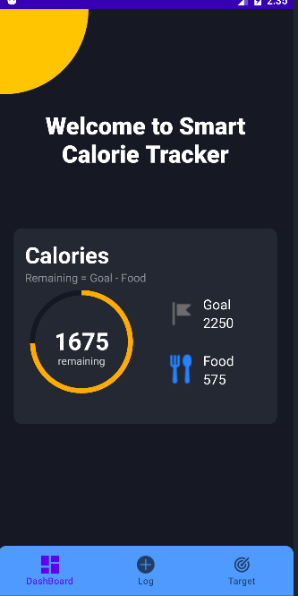
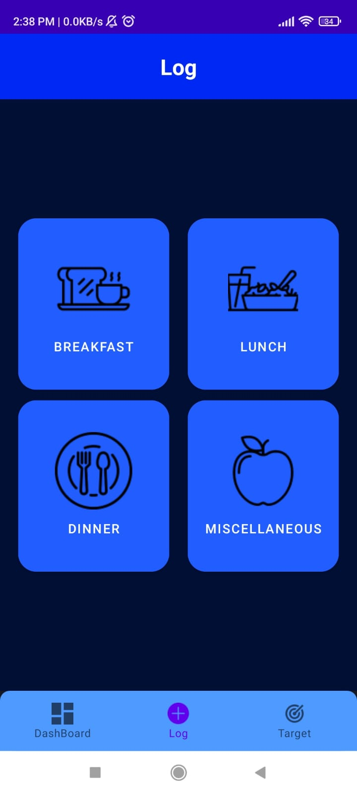
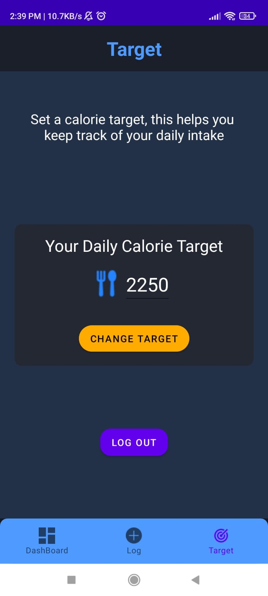
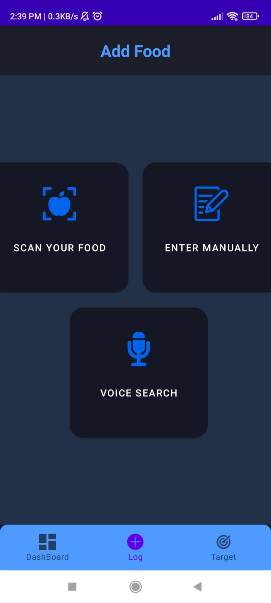
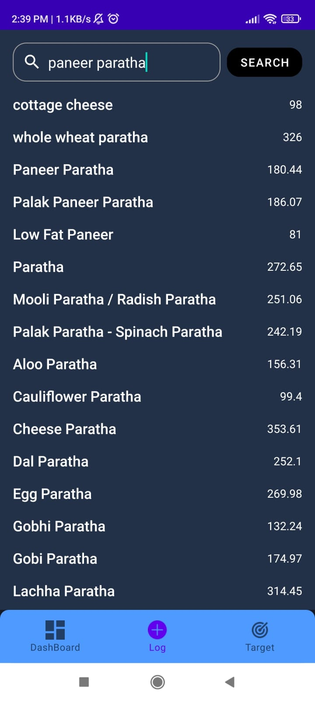
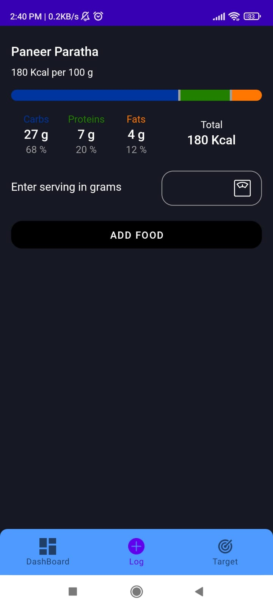

# MyHealthApp - Calorie and Nutrition Tracker

Welcome to the MyHealthApp repository! This Android application is your personal tool for managing your daily calorie intake and tracking nutrition. Whether you're on a fitness journey or maintaining a balanced diet, myHealthApp is here to support your health goals.

  
  
  

  
  
  

  
  

## Features

- **User Authentication**: Safeguard your data by registering an account or logging in securely.
- **Manual and Scanned Intake**: Log your food intake manually by selecting items from a comprehensive database, or utilize the integrated image scanning feature to retrieve nutrition information instantly.
- **Daily Calorie Goal**: Set and monitor your daily calorie limit to stay on track with your dietary objectives.
- **Real-time Tracking**: Stay informed about your calorie consumption throughout the day with real-time updates.
- **User-friendly Interface**: Navigate effortlessly through the app's intuitive design and log your intake with ease.

## Getting Started

To start using myHealthApp, follow these steps:

1. Clone this repository: `git clone https://github.com/ayush-geek/myhealthapp.git`
2. Open the project in Android Studio.
3. Build and run the app on your preferred emulator or physical device.
4. Begin tracking your calories and nutrition intake right away!

## Third-Party APIs

We've seamlessly integrated third-party APIs to enhance your experience:
- Food Recognition API: Identify food items from images and retrieve comprehensive nutrition details for scanned foods.
- Image Recognition API: Enhance the accuracy of food scanning with general image recognition capabilities.

For optimal performance, make sure to obtain API keys from these providers.

## Contributing

Contributions to myHealthApp are greatly appreciated! Should you encounter bugs, have suggestions for enhancements, or wish to introduce new features, please don't hesitate to open an issue or submit a pull request.

## License

This project is licensed under the [MIT License](LICENSE).

---

Prioritize your health with myHealthApp. Should you require assistance or have any inquiries, feel free to reach out.
